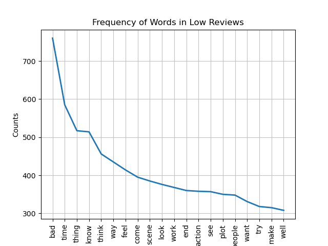

# Exploring IMDB Movie Reviews
 
 In this project, different aspects of movie reviews available on IMDB are explored and visualized.
 
 The movie reviews used for this exploration and analysis exercise are available at [www.IMDB.com](www.imdb.com).

 ## NLP Analysis of Movie Reviews

 Movie reviews were sorted based on score, with those scoring at or above 9.0 being designated as High Reviews, while those at 4.0 or below were designated as Low Reviews. Movies with scores in the middle range were not included in the analysis.
 
 High and Low group reviews were compared using different exploratory tools, the visualizations for which can be found below.

 -------------------------------------------------------

 ### WordCloud

 A WordCloud comparing the frequency of words in both High and Low reviews.

 

 -------------------------------------------------------

 ### FreqDist
 
 Frequency Distribution of words in High and Low reviews.

  
 

 -------------------------------------------------------

 ### N-grams

 Examining the most frequent bi-grams in High and Low review groups.

 | High Review N-grams    |   High Review Freq | Low Review N-grams          |   Low Review Freq |
|:-----------------------|-------------------:|:----------------------------|------------------:|
| ('comic', 'book')      |        0.000537023 | ('final', 'rating')         |       0.00123433  |
| ('special', 'effect')  |        0.000459194 | ('finished', 'product')     |       0.000925747 |
| ('sci', 'fi')          |        0.000389147 | ('appeal', 'poor')          |       0.000916104 |
| ('star', 'wars')       |        0.000389147 | ('poor', 'finished')        |       0.000916104 |
| ('long', 'time')       |        0.00034245  | ('rating', 'thing')         |       0.000916104 |
| ('john', 'wick')       |        0.000334667 | ('thing', 'appeal')         |       0.000916104 |
| ('real', 'life')       |        0.000334667 | ('special', 'effect')       |       0.000703954 |
| ('<', '>')             |        0.000319101 | ('avoid', 'possible')       |       0.000559306 |
| ('action', 'sequence') |        0.000311318 | ('boring', 'disappointing') |       0.000559306 |
| ('spider', 'man')      |        0.000295752 | ('disappointing', 'avoid')  |       0.000559306 |

-------------------------------------------------------

## Observations and Recommendations

**High-rated movies**

- Movies with high ratings had comments centering on popular franchises, specific stories, and specific characters. Maybe audiences are more forgiving of mediocre movies if they feature beloved characters, or perhaps audiences find these movies truly entertaining to a high degree.
- High rated movies are more likely to be action or science-fiction stories, with high production, quality soundtracks, and good visuals.
- Reviews mention favorite directors, and gripping, enthralling stories.

**Low-rated movies**

- These movies had less comments about characters and franchises - the content - and more comments about the quality of the movie.
- Low-rated movies suffered from low quality production, with movies that looked and felt unfinished. Visuals were weak, and the soundtracks were lacking.
- Stories were more likely to be viewed as boring, predictable, and a waste of time. Audiences were unimpressed with attractive no-name actors in tales that did not engage or pull them in. 
